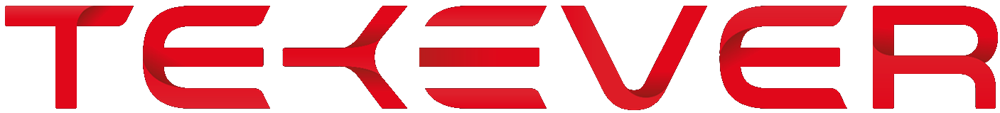
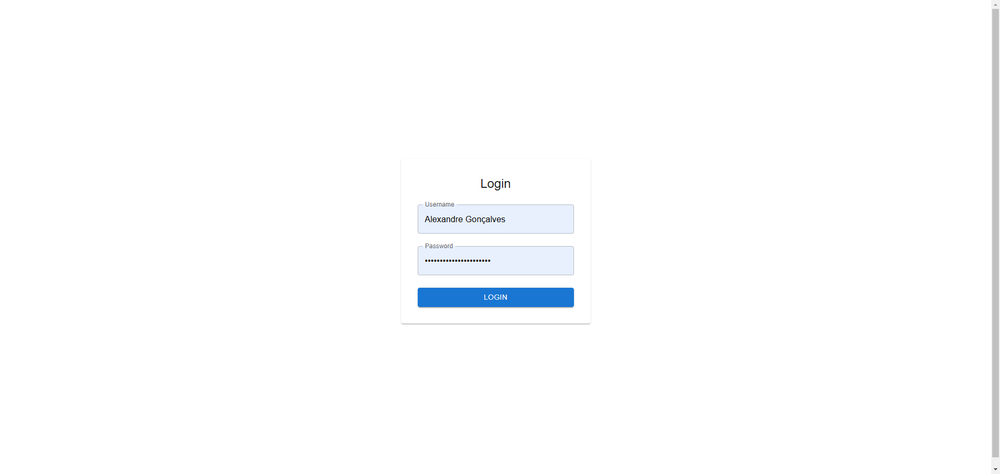
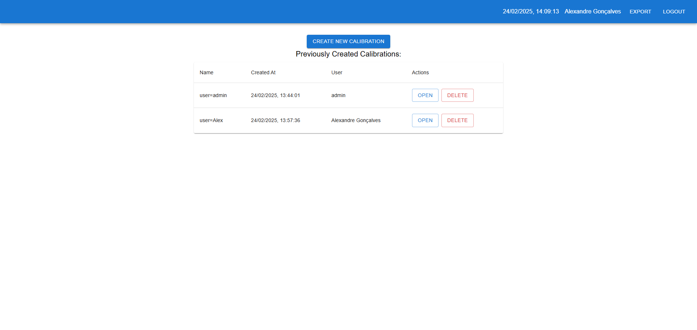
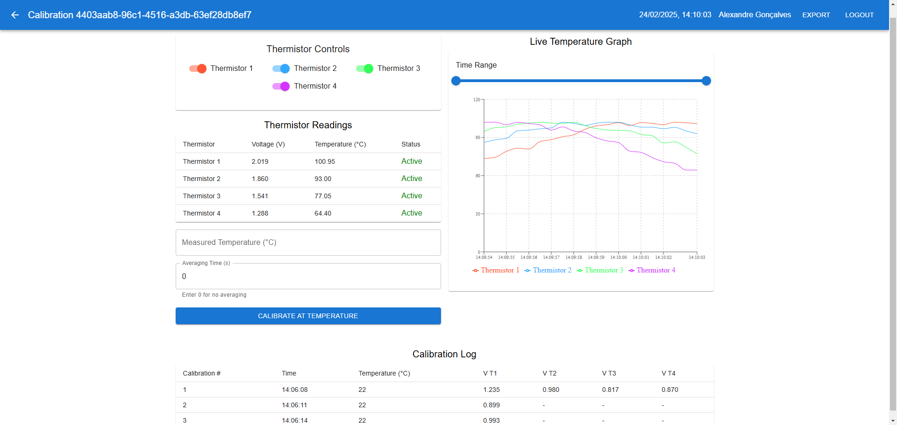

# Calibration App

## Overview

The **Calibration App** was created to provide an end-to-end solution for managing calibration projects and logs. It is designed to help laboratory technicians, engineers, and calibration specialists easily record, track, and review calibration data for various sensors and instruments. The application integrates real-time sensor data with user-driven calibration events to ensure accuracy and traceability in calibration processes.

## Why This App Was Created

Accurate calibration is critical in industries such as manufacturing, aerospace, healthcare, and research. In many settings, calibration data is recorded manually, which can lead to errors and inefficiencies. The Calibration App was developed to:

- **Streamline Calibration Processes:** Automate the recording of calibration events and sensor readings.
- **Ensure Data Accuracy:** Provide real-time validation and secure storage of calibration logs.
- **Improve Traceability:** Keep a detailed history of calibration events associated with each user.
- **Facilitate Easy Monitoring:** Offer a user-friendly interface to view and manage calibration projects and logs.

## Who It's Made For

This application is intended for:

- **Laboratory Technicians:** Who require a reliable system to record calibration events.
- **Engineers:** Looking for an integrated solution to track sensor performance and calibration history.
- **Quality Assurance Teams:** Needing to ensure that all instruments are properly calibrated and maintained.
- **Administrators:** Who want to monitor calibration activities across multiple users and projects.

## How to Use the App

### For End Users

1. **Login:**

   - Navigate to the login page.
   - Use your provided credentials (e.g., `admin`/`admin` for testing or your own username/password).
   - Upon a successful login, a JSON Web Token (JWT) is generated and stored for secure API access.
     

2. **View Calibration Projects:**

   - Once logged in, the dashboard (Calibration Index) displays a list of previously created calibration projects.
   - Each project shows its name, creation date, and the user who created it.
     

3. **Create a New Calibration Project:**

   - Click the "Create New Calibration" button.
   - Enter the project name and confirm.
   - The project is saved and immediately displayed on the dashboard.

4. **Manage Calibration Logs:**

   - Select a calibration project to open detailed views.
   - Add calibration logs that record sensor readings and calibration values.
   - View, edit, or delete logs as needed.
     

5. **Export:**

   - Saves a .cvs file with the current project saved calibrations.

6. **Logout:**
   - Use the logout option from the top bar to safely end your session.

### For Administrators

- **Monitor All Projects:**

  - Administrators have access to all calibration projects and can view logs across users.
  - A dedicated admin endpoint is available for quick overviews and reporting.

- **Database Management:**
  - The app uses a managed PostgreSQL database, which can be monitored and managed using tools like pgAdmin or Render’s built‑in dashboard.
  - Administrators can add, modify, or remove user accounts and calibration projects as needed.

## Technologies Used

- **Backend:** FastAPI, SQLModel, Uvicorn
- **Frontend:** React, Vite, Material-UI
- **Authentication:** JWT (JSON Web Tokens), OAuth2
- **Database:** SQLite (for local development) and PostgreSQL (managed database for production)
- **Deployment:** Render (for the backend) and Vercel (for the frontend)

## Setup & Deployment

### Local Development

1. **Clone the Repository:**
   ```bash
   git clone https://github.com/alextekever/calibration-app.git
   cd calibration-app
   ```
